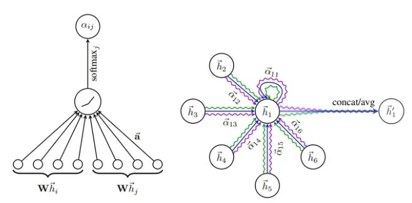

# 图神经网络应用简述

## 背景：

最近在进行一个根据公开语料创建医疗诊疗知识库用于根据医疗发票推断可能的疾病用于风险预判。

## 基本概念：

主要节点类型由四类构成：科室，检查，用药，疾病。  
主要边类型有四类

## GAT的概念
要先讲清楚GAT，必须先理解什么是GNN图神经网络。图神经网络其实就是用一个节点和他相邻的节点的特征信息进行sum，mean或者max等操作提取出来再拼接此节点自己的特征放入到多层全连接中去，再不断更新其他节点的特征参数。也就是说将一个节点用一个特征向量来进行表示。

GAT主要可以解决融合周边特征时权重是固定的，不够灵活。利用attention机制给节点之间的边以权重，帮助学到网络的结构信息。

而GAT很显而易见就是把注意力机制使用到提取周边1阶邻居节点的特征上了，假设节点i有一个邻居节点j，节点的embedding向量分别是N维，即(N,)
那会有一个权重矩阵（要学习的参数）N*M,将节点变为（M,），然后再将变化后的i,j拼接到一起
$$
\mathbf{x}^{\prime}_i = \sum_{j \in \mathcal{N}(i) \cup \{ i \}}
\alpha_{i,j}\mathbf{\Theta}_t\mathbf{x}_{j}
$$
$$
\alpha_{i,j} =
        \frac{
        \exp\left(\mathrm{LeakyReLU}\left(
        \mathbf{a}^{\top}_{s} \mathbf{\Theta}_{s}\mathbf{x}_i
        + \mathbf{a}^{\top}_{t} \mathbf{\Theta}_{t}\mathbf{x}_j
        \right)\right)}
        {\sum_{k \in \mathcal{N}(i) \cup \{ i \}}
        \exp\left(\mathrm{LeakyReLU}\left(
        \mathbf{a}^{\top}_{s} \mathbf{\Theta}_{s}\mathbf{x}_i
        + \mathbf{a}^{\top}_{t}\mathbf{\Theta}_{t}\mathbf{x}_k
        \right)\right)}
$$
从注意力公式上来看，$\alpha_{i,j}$是节点i和节点j之间的注意力系数，先观察分子：  
1、计算节点$i$和节点$j$的特征向量的线性变换结果。  
2、然后，通过$LeakyReLU$激活函数引入非线性。  
3、最后，作为softmax的分子部分。   
从分母上看，对节点$i$及其所有邻居节点（包括节点$i$本身）进行相同的计算。
将所有这些结果的指数值相加，得到一个归一化因子。   
GAT也有多头注意力，其实就是对相同的节点创造多个w矩阵计算$\alpha$向量来实现。
计算的图示在原论文中，已经一目了然了：

## 比较好用的库
### pytorch-geometric完美适配Pytorch

### dgl
亚马逊开发的图神经网络库，比较优秀的是有中文的使用指南，可以帮助快速入门。